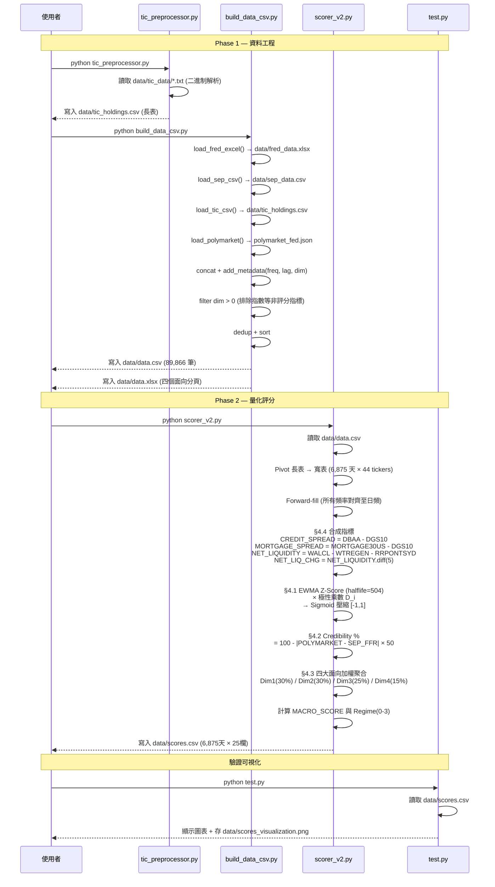
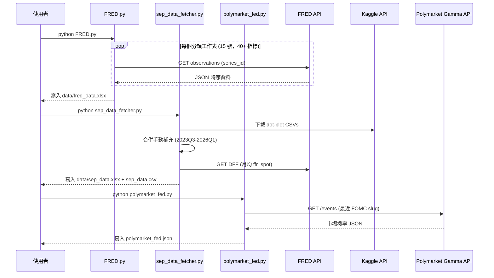
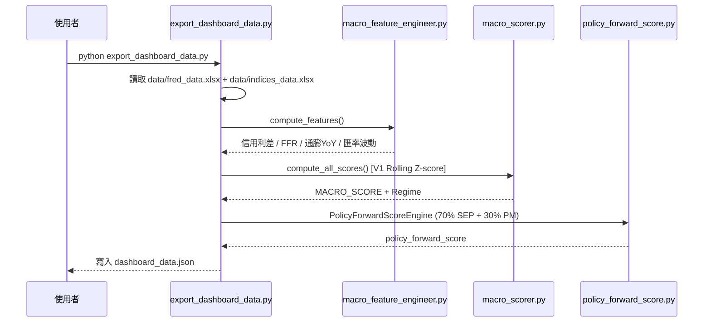
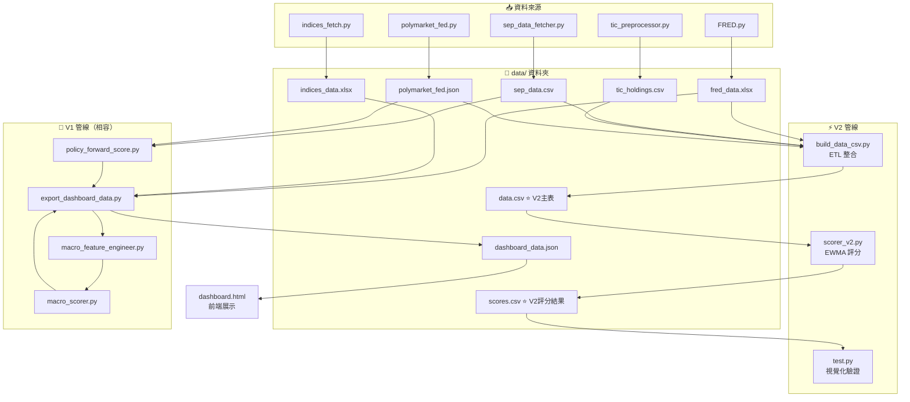

# 1-大環境 模組架構說明

> 本模組為 **Stock King 平台**的宏觀環境分析核心，負責蒐集原始總經資料、計算多維度景氣評分，並將結果匯出至前端 Dashboard。
>
> **當前版本：V2**（已完成 Phase 1 資料工程 & Phase 2 量化評分，Phase 3 前端展示進行中）

---

## 📁 檔案一覽

### 🔧 資料抓取層（Data Collection）

| 檔案 | 主要職責 |
|---|---|
| `FRED.py` | 從 FRED API 抓取所有景氣序列（信用、政策、通膨、匯率等 40+ 指標），存為多工作表的 `data/fred_data.xlsx` |
| `indices_fetch.py` | 抓取主要美股指數（SP500、NASDAQ、DJIA、Russell 2000），存為 `data/indices_data.xlsx`（可供 Dashboard 展示用，不進入評分管線）|
| `sep_data_fetcher.py` | 抓取 FOMC SEP 點陣圖資料（Kaggle CSV + 手動補充），存為 `data/sep_data.xlsx` / `data/sep_data.csv` |
| `polymarket_fed.py` | 從 Polymarket Gamma API 抓取最近 FOMC 利率決策的市場機率，存為 `polymarket_fed.json` |
| `tic_preprocessor.py` | 解析美國財政部 TIC 原始 `.txt` 文字檔（含非標準 `\r\r\n` 換行），轉換為標準長表 `data/tic_holdings.csv` |

### ⚙️ ETL / 資料整合層（V2 新增）

| 檔案 | 主要職責 |
|---|---|
| `build_data_csv.py` | **V2 核心 ETL**：整合 5 大資料來源（FRED、SEP、TIC、Polymarket）→ 標準化長表 → 加入 `frequency / lag_category / dimension` 元資料 → 輸出 `data/data.csv`（主表）與 `data/data.xlsx`（四個面向分頁） |

### 📐 評分層（Scoring）

| 檔案 | 主要職責 |
|---|---|
| `scorer_v2.py` | **V2 評分引擎（主力）**：讀取 `data/data.csv` → 計算合成指標 → EWMA Z-Score + 極性 → Sigmoid 壓縮 → 四大面向加權聚合 → 輸出 `data/scores.csv` |
| `macro_scorer.py` | V1 評分引擎（Rolling Z-score → 離散子分數映射 → 三大模組聚合），供 `main.py` 與 `export_dashboard_data.py` 使用 |
| `policy_forward_score.py` | 政策預期引擎（SEP 點陣圖 70% + Polymarket 30%），輸出 `policy_forward_score ∈ [-2,+2]` |

### 🛠️ V1 輔助工具（維持相容性）

| 檔案 | 主要職責 |
|---|---|
| `config.py` | 全域參數：FRED Series 清單、Z-score 視窗、V1 子分數權重、Regime 門檻 |
| `macro_data_loader.py` | 直接透過 FRED API 抓取資料並計算 CPI YoY，供 `main.py` 使用 |
| `macro_feature_engineer.py` | 計算 V1 信用利差、FFR、通膨 YoY、美元指數變動率 |
| `export_dashboard_data.py` | 讀取 Excel 快取 → V1 評分 → 整合政策預期 → 匯出 `dashboard_data.json` |
| `main.py` | V1 完整流程：直接打 API → 特徵工程 → 評分 → 輸出 `macro_score_2025.png` |

### 📊 視覺化與前端

| 檔案 | 主要職責 |
|---|---|
| `test.py` | **V2 視覺化驗證**：讀取 `data/scores.csv` → 繪製四大面向 + MACRO_SCORE 時序圖 → 輸出 `data/scores_visualization.png` |
| `dashboard.html` | 前端 Dashboard：讀取 `dashboard_data.json`，以 Chart.js 繪製多張互動圖表（Chart A-E） |

---

### 📂 資料檔（`data/` 資料夾）

| 檔案 | 說明 |
|---|---|
| `data/fred_data.xlsx` | FRED API 原始快取（多工作表） |
| `data/sep_data.csv` / `.xlsx` | FOMC SEP 點陣圖快取 |
| `data/tic_holdings.csv` | TIC 外資持有美債長表（由 `tic_preprocessor.py` 產生） |
| `data/indices_data.xlsx` | 美股指數快取（供 Dashboard 顯示，不進評分） |
| **`data/data.csv`** | **V2 主資料表**：標準長表，89,866 筆 × 6 欄（`observation_date, ticker, raw_value, frequency, lag_category, dimension`） |
| **`data/data.xlsx`** | **V2 分析表**：四個面向分頁的 Excel（面向一～四） |
| **`data/scores.csv`** | **V2 評分結果**：6,875 交易日 × 25 欄（各指標 Score、四大面向分數、MACRO_SCORE、Regime） |
| `data/scores_visualization.png` | `test.py` 輸出的 V2 分數走勢圖 |
| `polymarket_fed.json` | 最新 Polymarket FOMC 機率（存於根目錄） |
| `policy_forward_score.json` | V1 政策預期評分快取 |
| `dashboard_data.json` | V1 前端 Dashboard 所需完整 JSON |

---

## 🔄 系統流程圖

### 流程一：V2 主管線（Phase 1 + Phase 2）



---

### 流程二：資料抓取（更新各原始來源）



---

### 流程三：V1 Dashboard 匯出（維持相容）



---

## 🧩 模組依賴關係



---

## 📐 V2 評分模型說明

### §4.4 合成指標（先於 Z-Score 計算）

| 合成指標 | 公式 | 理論依據 |
|---|---|---|
| `CREDIT_SPREAD` | `DBAA - DGS10` | Bernanke「外部融資溢酬」：企業違約恐慌 |
| `MORTGAGE_SPREAD` | `MORTGAGE30US - DGS10` | 一般家庭信用緊縮壓力 |
| `NET_LIQUIDITY` | `WALCL/1000 - WTREGEN - RRPONTSYD` | Fed 真實流入市場的淨流動性 |
| `NET_LIQ_CHG` | `NET_LIQUIDITY.diff(5)` | 淨流動性的週變動率（用於評分） |

### §4.1 EWMA Z-Score + 極性

| 指標 | D_i | 最新值 (2026-05-08) |
|---|---|---|
| CREDIT_SPREAD | −1 | +0.1439 |
| MORTGAGE_SPREAD | −1 | +0.1778 |
| DRBLACBS | −1 | −0.1614 |
| NET_LIQ_CHG | +1 | +0.4266 |
| DFF | −1 | −0.0220 |
| T10Y2Y | +1 | +0.0919 |
| JTSJOL | +1 | −0.1161 |
| JTSQUR | +1 | −0.1604 |
| BABATOTALSAUS | +1 | +0.2983 |
| INDPRO | +1 | +0.1372 |
| PAYEMS | +1 | +0.1749 |
| DTWEXBGS | −1 | +0.0637 |
| EMVEXRATES | −1 | +0.0991 |
| TIC_GRAND_TOTAL_MOM | +1 | −0.2656 |

### §4.3 四大面向權重架構

| 面向 | 佔 MACRO_SCORE | 組成 | 最新分數 |
|---|---|---|---|
| 面向一（信用市場）| 30% | 70% RT: CREDIT_SPREAD, MORTGAGE_SPREAD<br/>30% Lag: DRBLACBS | +0.064 |
| 面向二（政策流動性）| 30% | 60% RT: NET_LIQ_CHG, DFF<br/>40% Lead: T10Y2Y<br/>+ Credibility % 獨立輸出 | +0.316 |
| 面向三（經濟動能）| 25% | 70% Lead: JTSJOL, JTSQUR, BABATOTALSAUS<br/>30% Lag: INDPRO, PAYEMS | +0.052 |
| 面向四（國際資本）| 15% | 70% RT: DTWEXBGS, EMVEXRATES<br/>30% Lag: TIC_GRAND_TOTAL_MOM | −0.023 |

### §4.2 體制可信度（Credibility %）

```
Credibility % = Max(0, 100 − |POLYMARKET_RATE − SEP_FFR_CURRENT| × 50)
```

### Regime 判定

| MACRO_SCORE | Regime | 標籤 |
|---|---|---|
| ≥ +0.3 | 3 | Expansionary（寬鬆/有利風險資產） |
| ≥ 0.0 | 2 | Neutral-Bullish（中性偏多）|
| ≥ −0.3 | 1 | Neutral-Cautious（中性偏保守）|
| < −0.3 | 0 | Contractionary（緊縮/風險極高）|

**最新 MACRO_SCORE（2026-05-08）：+0.0763 → Regime 2: Neutral-Bullish**

---

## 🚀 執行順序建議

```bash
# ── Phase 1：更新原始資料（每月或按需執行）──────────────────
python FRED.py                   # 更新 data/fred_data.xlsx（40+ FRED 指標）
python sep_data_fetcher.py       # 更新 data/sep_data.csv（FOMC 點陣圖）
python polymarket_fed.py         # 更新 polymarket_fed.json（FOMC 前後執行）

# TIC 資料需手動下載後放入 data/tic_data/ 資料夾
python tic_preprocessor.py       # 解析 TIC txt → data/tic_holdings.csv

# ETL 整合（所有原始資料備妥後執行）
python build_data_csv.py         # 輸出 data/data.csv + data/data.xlsx

# ── Phase 2：計算評分 ─────────────────────────────────────────
python scorer_v2.py              # 輸出 data/scores.csv（四大面向 + MACRO_SCORE）

# ── 驗證視覺化 ────────────────────────────────────────────────
python test.py                   # 顯示 + 儲存 data/scores_visualization.png

# ── Phase 3（進行中）：前端展示 ──────────────────────────────
# 開啟瀏覽器查看 dashboard.html（目前仍使用 V1 dashboard_data.json）
python export_dashboard_data.py  # V1 相容：輸出 dashboard_data.json

# ── 可選：V1 完整管線 ──────────────────────────────────────────
python indices_fetch.py          # 更新 data/indices_data.xlsx（供 Dashboard 展示）
python main.py                   # V1 直接 API 抓資料 + 評分 + 存 macro_score_2025.png
```

---

## 📋 開發進度

| Phase | 狀態 | 說明 |
|---|---|---|
| Phase 1：資料工程 | ✅ 完成 | TIC 解析、ETL 整合、`data.csv` / `data.xlsx` 輸出 |
| Phase 2：量化評分 | ✅ 完成 | EWMA Z-Score、合成指標、四大面向聚合、`scores.csv` 輸出 |
| Phase 3：前端展示 | 🔄 進行中 | `dashboard.html` V2 版本更新，接入 `scores.csv` |

---

*最後更新：2026-05-13*
